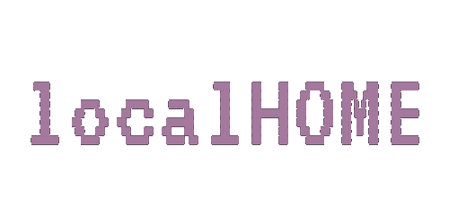

<div id="top"></div>

<!-- PROJECT LOGO -->
<br />
<div align="center">
  <a href="https://github.com/terminalPoltergeist/localHOME">
    
  </a>

  <p align="center">
    Not just localhost... localHOME
    <br/>
    A locally hosted browser start-page
  </p>

  
  
  
</div>

<br/>

## Installation
Currently there is no packaging for this project. The source must be downloaded and the app built manually.
<br/>
To do so, download the .zip file from the latest [release](https://github.com/terminalPoltergeist/localHOME/releases).
<br/>
Open the archive and run ```npm run build``` to build the webpack bundles.
<br/>
Then run ```npm start``` to start the server.


### To-dos
*things I would like to implement. This will be migrated to issues upon inital release*

- [ ] make custom page for editing configs
- [ ] integrate sql for configs?

### Credit 

